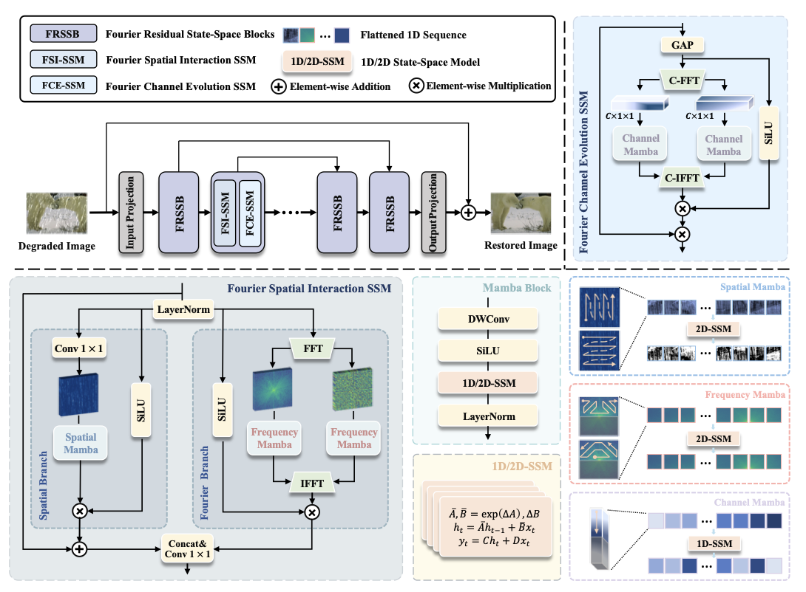

</img>

## FourierMamba

Unofficial Implementation of FourierMamba Block from the <a href="https://arxiv.org/pdf/2405.19450">FourierMamba</a> paper, for image de-raining using State Space Models.

## Usage

1 FourierMamba Block

```python
import torch
from fourierMamba import FourierMamba


model = FourierMamba(inp_channels=3, out_channels=3, dim=48)
x = torch.randn(2, 3, 128, 128)
out = model(x)

```


## Todo

- [ ] reduce time complexity on scanning.
- [ ] add analysis.
- [ ] adding a training and evaluation script.

## References
1. [aSleepyTree/FreqMamba](https://github.com/aSleepyTree/FreqMamba)


## Citations

```bibtex
@misc{@article{Li2024FourierMambaFL,
  title={FourierMamba: Fourier Learning Integration with State Space Models for Image Deraining},
  author={Dong Li and Yidi Liu and Xueyang Fu and Senyan Xu and Zheng-Jun Zha},
  journal={ArXiv},
  year={2024},
  volume={abs/2405.19450}
}

```